# Live check: flow across four projects (DOR-2533, phase F5)

**Date:** 2026-09-29 · **flow:** 0.53.0 (this branch) · **DorkOS:** `origin/main` at `3c7612d9f` (0.92.x)

The spec's live check (Testing Strategy, "Live check before the last phase merges") asks for
four things on the operator's machine. The operator's own DorkOS, data, repos, Linear and GitHub
were off limits, so this ran on a separate DorkOS instead. The last section is a short list for
repeating it on the real setup.

## How it was set up

- **A separate DorkOS.** A throwaway worktree of `dorkos` at `origin/main`, built, and started
  with `NODE_ENV=production` on port 5443, its own `DORK_HOME` and `HOME` in a scratch folder,
  `DORKOS_TEST_RUNTIME=true` (no model, no spend) and `DORKOS_SEARCH_NO_EXTERNAL_HISTORY=true`.
  It was stopped by its own PIDs, and the worktree and every scratch folder were removed after.
- **Four projects.** Four scratch git repos (`alpha`, `beta`, `gamma`, `delta`), each with
  `origin` set to `https://github.com/live/<name>.git` and flow from this branch installed at
  project scope, the way the Marketplace does it (`.dork/plugins/flow`, plus an entry in
  `DORK_HOME/marketplace/project-installs.json`). The extension was enabled and approved in the
  scratch `config.json`.
- **A fake tracker.** Each repo's `.agents/flow/config.json` picks the `fake` tracker. flow only
  runs a project's own adapter after a person allows it, and never one that loads code from
  outside its folder, so the shipped fake (`adapters/reference/fake/`) was bundled into one
  self-contained `adapter.ts`, with its backlog beside the config. It was allowed with the
  lens's **Allow** button.
- **A fake forge.** A small `gh` stand-in first on the server's `PATH` kept pull requests in a
  JSON file and logged every call. Checks always pass, and `gh pr merge --auto
--match-head-commit <sha>` merges the branch into the repo's `main` at once, as GitHub's
  auto-merge would.
- **Runs were seeded, not worked.** Each project got one run record in `.dork/flow/flow-state.json`
  (`beta`'s at the review gate with a clean review at its head and PR #7 open), so no agent ran.
- **Accounts.** Two fake Claude Code accounts (`work`, `side`) in the scratch `config.json`.
  flow's `fleet.json` kept `work` out except for `live/alpha` and `live/beta`.
- **Screens** were driven with Playwright (headless Chromium) at 1600 × 1000.

## Results

| #   | Check                                                                                  | Result                                                                 |
| --- | -------------------------------------------------------------------------------------- | ---------------------------------------------------------------------- |
| 1   | The lens follows the chat across all four projects                                     | **Pass**, after two fixes (below)                                      |
| 2   | A timed pause ends on time with DorkOS quit                                            | **Pass**                                                               |
| 3   | A review gate approved from the inbox arms and merges                                  | **Pass** (fake forge)                                                  |
| 4   | The account move moves "Only for these repos", and another project refuses the account | **Pass** for the move and both rules; a chat launch could not be tried |

### 1. The lens follows the chat

Moving between chats in the four repos (in-app navigation, no reload) switched the Flow tab to
that project each time: its tracker team, its run and the run's state. Outside every project it
showed "All projects": only `beta` (1 needs you), "3 other projects are fine", and "Open Flow
home →".

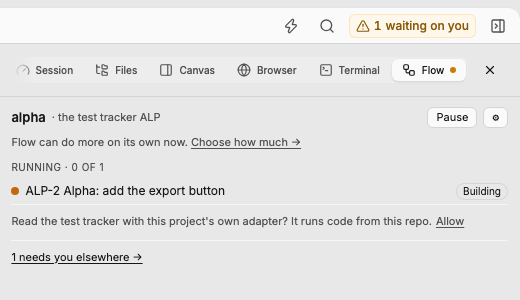 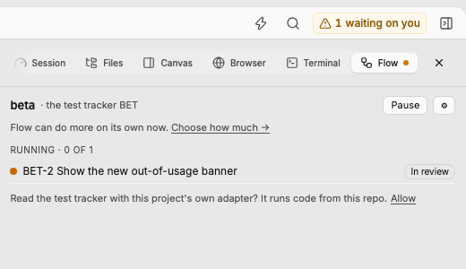 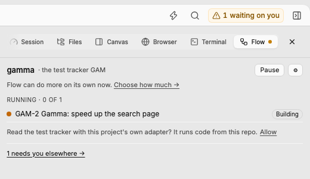
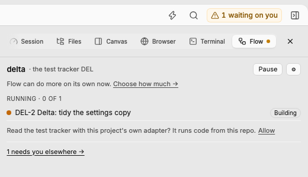 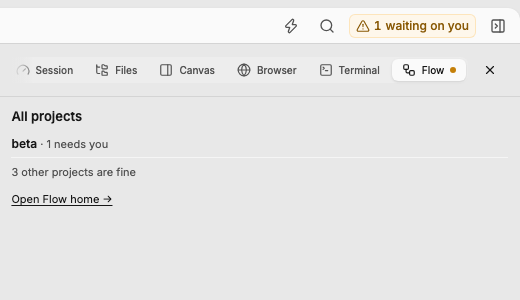 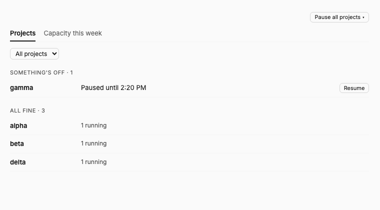

It failed at first, for two reasons in flow, both fixed on this branch:

- **flow's server half did not build on DorkOS.** DorkOS parses every `.ts` file as TSX, and
  `lib/shared-storage.ts` had `async <T>() => …`, which TSX reads as a tag. The build failed
  (`Expected "}" but found "=>"`), so `/api/ext/flow/*` answered "Extension 'flow' has no server
  routes": no lens data, no pause routes, no inbox asks. This has been true since 0.49.0, when the
  file arrived. Fixed with method shorthand; `bundle-safety.test.ts` now parses every file the
  server and client entries reach as TSX, so it cannot come back.
- **The palette's pause dialogs broke the whole page.** DorkOS draws every registered dialog all
  the time and passes it `open`; flow's pause dialogs ignored it and drew both menus below the
  app, pushing the top bar, the right panel and the status bar out of view. They now draw nothing
  until opened, as a real dialog that Escape or a click outside closes (tests in
  `activate.test.ts`).

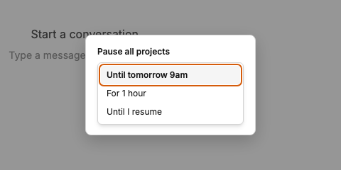

### 2. A timed pause ends on time with DorkOS quit

- From the lens, **Pause → For 1 hour** on `gamma` wrote `until` into `.agents/flow/paused.json`
  and the header read "Paused until 2:20 PM" with Resume.
  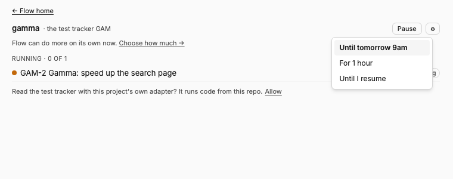 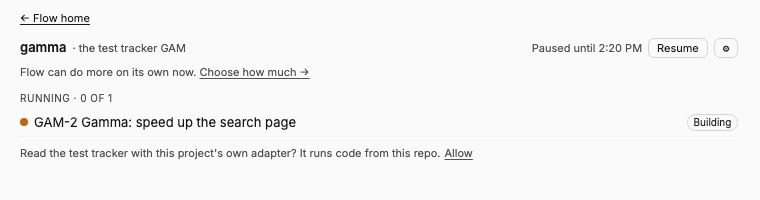
- For a short end, `delta` was paused through the same person-only route the menu uses,
  `POST /api/ext/flow/pause {"project":"delta","until":"<now + 90s>"}`. `flow next` then refused:
  "flow is paused until 2026-09-29T18:21:52.000Z".
- DorkOS was stopped (by PID) at 18:20:23. At 18:21:57, with DorkOS still stopped and
  `paused.json` still on disk, `flow next` ran without `--manual` and `flow status` reported
  `"paused": null`. The engine ended the pause by itself.
- After DorkOS started again, its expiry sweep removed the expired `paused.json`; `gamma`'s
  one-hour pause stayed in place.

### 3. A review gate approved from the inbox

- `beta`'s run at the review gate raised "Ship Show the new out-of-usage banner?" with "It's
  built, and the reviewer agent found nothing. Shipping merges it into the app." Until the
  project's own adapter was allowed, the ask offered only "Open" (flow cannot answer through an
  adapter it may not run); after **Allow** it became **Ship it** / **Send it back**.
  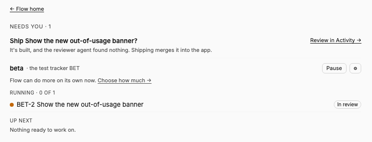 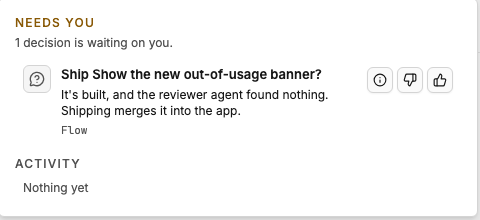
- **Ship it** in the Activity inbox ran `flow review BET-2 --approve --by person` with the commit
  the ask showed. The fake forge logged `gh pr review 7 --approve` (the author was another
  account) and then `gh pr merge 7 --auto --match-head-commit 3a8e7a0…`, and merged it:
  `main` gained "Merge PR #7". The tracker item got the comment "Shipped from DorkOS."
- DorkOS recorded the decision as approved by a person, with the offer "Shipped. Next time, ship
  on its own when the reviewer agent approves?" and a settings patch for `ship: tell`. The inbox
  popover closed on the click, so the offer line was not seen on screen.
- The ask did not come back on later polls. The run stays at the review gate until `/flow:done`
  closes it after the merge, as the spec says for a run outside a drain.
- It showed as "Building" in the lens; that was a flow bug, fixed here: a run VERIFY left at the
  gate now reads "In review" (`model.test.ts`).

### 4. Moving "Only for these repos"

- Before: Settings → Flow showed `work` kept out with "Only for these repos: live/alpha,
  live/beta" and "Move "Only for these repos" into DorkOS? DorkOS will keep Work to alpha and
  beta. **Move it**". DorkOS itself still allowed `work` in `gamma`.
  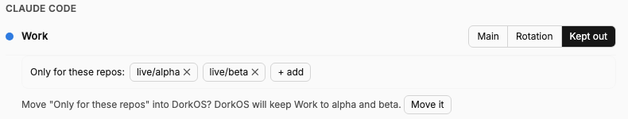
- **Move it** set DorkOS's `onlyProjects` for `work` to exactly the `alpha` and `beta` roots, then
  turned flow's role for `work` to rotation and dropped its repo list (every project runs
  behaviour 2, so flow did not hold the role back). The row read "Only for alpha, beta · Change
  in Settings → Runtimes →" and "Moved to DorkOS: Work is now only for alpha and beta."
  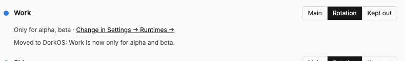
- After: DorkOS's `account-eligibility` said `work` is not eligible in `gamma` and is in `alpha`.
  In the terminal, `flow accounts pick` in `gamma` listed `work` as ineligible with
  `not-allowed-here` (DorkOS's rule), and in `alpha` ranked it.
- **Not tried: a chat launch in `gamma` on `work`.** DorkOS checks the account at launch only for
  Claude Code chats, and a test-mode DorkOS has no Claude Code runtime, so a refused launch could
  not be shown here. The rule it would apply is the one the eligibility route reported.

Settings, split by who a change reaches: 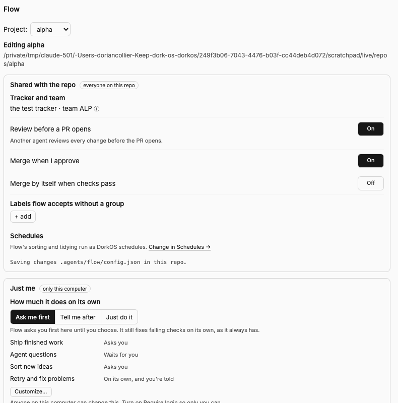

## For DorkOS core (not changed here)

- **`registerDialog(...).open()` opens nothing** (filed as DOR-2576). In
  `extension-api-factory.ts` it only sets a local variable; `DialogHost` reads the app store, so
  an extension's dialog never gets `open: true`. flow now keeps its own open state, so it does not
  depend on this.
- **An extension dialog's `onOpenChange` throws.** `DialogHost` hands every dialog a setter built
  from its `openStateKey` (`setExt-dialog:<id>`), a key the app store does not have, so calling
  `onOpenChange(false)` is a `TypeError` that core's client error reporter records. flow now calls
  it only for a dialog core itself opened, and never lets it break closing. Worth fixing with
  DOR-2576.
- **"Review in Activity →" lands where the ask is not.** The Activity page lists history; the open
  ask lives only in the "waiting on you" popover. On the same screen the Pulse tab said "All
  quiet. Nothing needs you." while the bell said 1 was waiting.
- **The right panel closes when you move to another project's chat,** so the Flow tab has to be
  reopened each time. The lens itself follows.

## Other notes

- The review ask's headline is "Ship <item title>?", which reads oddly when the title starts with
  a verb ("Ship Show the new out-of-usage banner?"). It follows the spec.
- The seeded runs had no live worker, so the lens said "Running · 0 of 1" beside them; flow counts
  only live drain workers there.

## What could not be checked here

- Real Linear and GitHub (a real sign-in, a real PR, the forge's own required checks).
- A Claude Code chat refused on a disallowed account (see 4), and real accounts' usage.
- The reviewer agent shipping on its own, questions with a deadline, and "While you were away":
  all need a model.
- The run chip (it needs chats that DorkOS links to tracker items) and the "Sign in" and "Sort
  them" buttons (`api.startWork` is not on DorkOS `main` yet).
- DorkOS schedules switched off by a pause and back on at its end.
- The desktop app and the phone.

## Repeat it on your own setup

1. Reinstall flow 0.53.0 in four projects and open DorkOS. The server log says "Server
   initialized for flow", not "Server Compilation failed for flow".
2. Open a chat in each project in turn: the Flow tab shows that project each time. Open one
   outside them: it shows "All projects".
3. Run "Flow: Pause all projects" from the palette: a dialog opens, Escape closes it, and nothing
   is drawn at the bottom of the page.
4. Pause one project **For 1 hour**. Quit DorkOS, wait past the end, and run `flow next` there:
   it no longer says "paused".
5. When a real item reaches the review gate, press **Ship it** in the waiting-on-you popover: the
   PR is approved (unless you wrote it) and merges once checks pass; the item gets "Shipped from
   DorkOS.". Note whether the "Next time, ship on its own…" line appears.
6. If an account has "Only for these repos", read this before pressing anything. **Move it** gives
   the account project limits in DorkOS (Settings → Runtimes shows "Only for …"): DorkOS will then
   refuse that account for every chat, schedule and handoff outside those projects, not just
   flow's. If every project already runs flow 0.52 or newer, the same press also turns flow's role
   for the account from Kept out to Rotation and drops flow's repo list; otherwise that waits for
   a second button, **Switch to DorkOS's rule**, which appears once every project is updated. To
   undo it, clear the account's limits in Settings → Runtimes and run
   `flow accounts set <id> --role kept-out --repos owner/name,...`. When you're ready, press
   **Move it**, then start a chat on that account in a project outside the list: DorkOS should
   refuse it.
